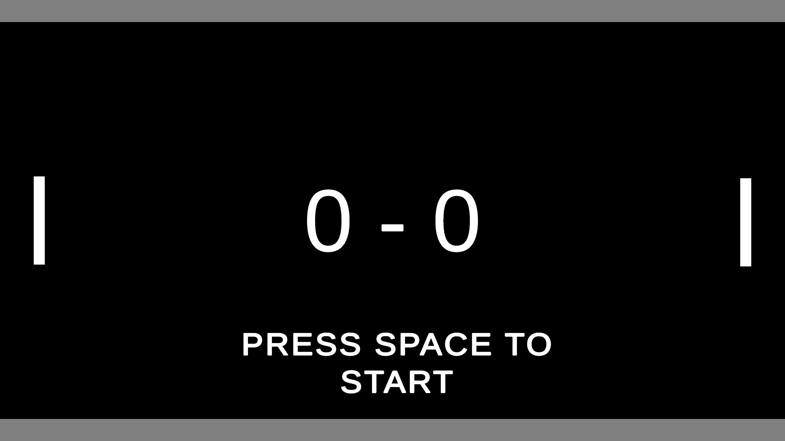

<p align="center">
  
</p>

# 🏓 Pong 2D Game

A polished and modern remake of the classic **Pong**, developed in Unity.  
This version includes **1v1 local multiplayer**, a fun and responsive **Player vs AI** mode, **smooth paddle movement**, **audio feedback**, and **real-time score tracking**. Perfect for retro arcade fans and Unity learners alike!

---

## 🎮 Game Modes

- 👥 **1v1 Local Multiplayer**  
  Classic two-player experience using the same keyboard.

- 🤖 **Player vs AI**  
  Solo mode with smooth and reactive AI paddle movement.

---

## ✨ Features

- 🧠 **Smart AI Mode** – Balanced difficulty and tracking logic.
- 🌀 **Smooth Paddle Movement** – Achieved using movement interpolation.
- 🔊 **Audio Feedback** – Sounds for paddle hits, goals, and background ambience.
- 🧾 **Score Tracking** – Live score displayed on screen.
- 🎨 **Simple and Clean UI** – Unity Canvas-based design.
- 📏 **Collision Detection** – With physics-based paddle-ball interactions.

---

## 🕹️ Controls

### Player 1:
| Action       | Key     |
|--------------|---------|
| Move Up      | `W`     |
| Move Down    | `S`     |

### Player 2 (or AI):
| Action       | Key         |
|--------------|-------------|
| Move Up      | `Up Arrow`  |
| Move Down    | `Down Arrow`|

---

## 🔊 Audio System

- 🎵 Background Music (looping)
- 🥁 Paddle Hit Sound
- 💥 Goal/Score Sound
- 🔉 UI Feedback (optional)

---

## 📦 How to Run the Game

1. Clone or download this repository.
2. Open it in **Unity Hub**.
3. Load the main scene (`MainScene.unity`).
4. Press the ▶️ button in the Unity editor to play.

```bash
git clone https://github.com/usmanbutt-dev/pong.git

---

## 🧑‍💻 Developer Info

- 👤 **Name:** Muhammad Usman Butt  
- 🎓 **Role:** Unity Developer / Game Development Student  
- 🏫 **Project Type:** Course Project / Personal Practice  
- 📅 **Year:** 2024
- 🛠️ **Experience:** 2+ years in Unity 2D & 3D game dev  
- 📚 **Skills Used:** Unity UI, Physics2D, AudioManager, Input Handling, AI Logic
